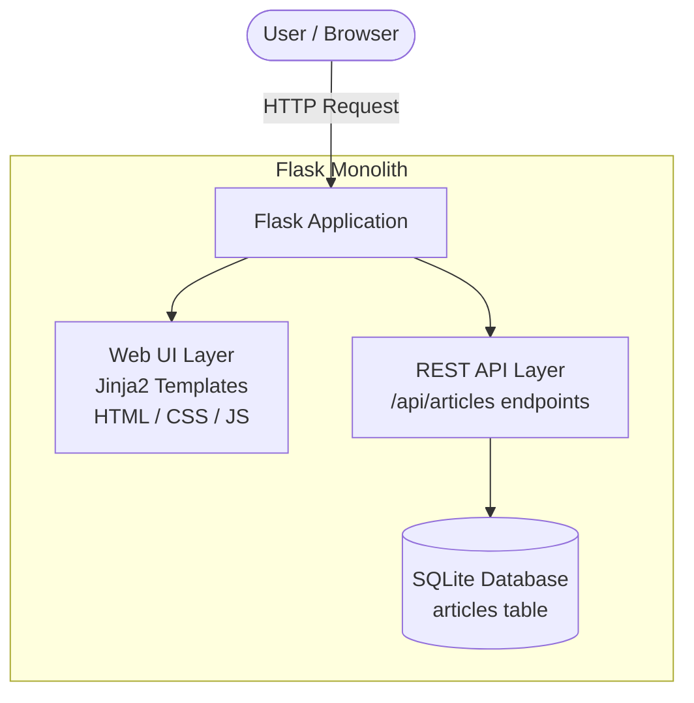

# Application Architecture

## Architecture Style
The application uses a simple **monolithic** architecture. A single Flask application serves both the frontend (HTML pages via Jinja2 templates) and the backend (REST API endpoints), all connected to a single SQLite database file.

## Architecture Diagram

## Layer Descriptions

| Layer | Technology | Responsibility |
|---|---|---|
| **Frontend / UI** | HTML, CSS, Vanilla JS, Jinja2 | Render submission forms, reviewer dashboard, status views. |
| **Backend / API** | Flask (Python) | Handle HTTP requests, validate input, execute business logic, serve templates and API responses. |
| **Database** | SQLite | Persist article records including title, content, author, status, and rejection comment. |

## Request Flow
1. User submits an article via the browser form.
2. Flask backend receives the POST request.
3. Backend validates required fields (title, content, author).
4. If valid, backend inserts the article into SQLite with status SUBMITTED.
5. Backend returns a success response.

## Validation
- Required fields: title, content, author.
- If any required field is empty, the backend returns a 400 error with a descriptive message.

## Status Handling
- New articles are saved with status **SUBMITTED**.
- Reviewer approve action changes status to **APPROVED**.
- Reviewer reject action changes status to **REJECTED** and stores the rejection comment.
- Only articles with status SUBMITTED can be approved or rejected.
