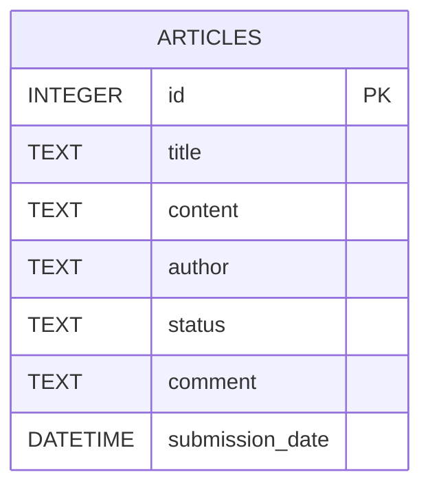

# Data Model

## Overview
The data model consists of a single table to track the News Publishing Workflow. No separate user or role tables are required because authentication and RBAC are explicitly out of scope.

## Entity: `articles`

| Field | Data Type | Required | Description | Constraints |
|---|---|---|---|---|
| `id` | INTEGER | Yes | Unique identifier for the article. | PRIMARY KEY, AUTOINCREMENT |
| `title` | TEXT | Yes | The title of the news article. | NOT NULL |
| `content` | TEXT | Yes | The main body of the article. | NOT NULL |
| `author` | TEXT | Yes | The name of the writer (simulated, plain text). | NOT NULL |
| `status` | TEXT | Yes | Current workflow state. | NOT NULL, IN ('SUBMITTED', 'APPROVED', 'REJECTED') |
| `comment` | TEXT | No | Rejection reason from the reviewer. | Required only when status = 'REJECTED' |
| `submission_date` | DATETIME | Yes | Timestamp of when the article was submitted. | DEFAULT CURRENT_TIMESTAMP |

## Status Values

| Status | Meaning |
|---|---|
| SUBMITTED | Article submitted by writer, awaiting review. |
| APPROVED | Reviewer has accepted the article. |
| REJECTED | Reviewer has declined the article. Rejection comment is stored. |

## Valid State Transitions

| From | To | Action |
|---|---|---|
| (New) | SUBMITTED | Writer submits the article. |
| SUBMITTED | APPROVED | Reviewer approves the article. |
| SUBMITTED | REJECTED | Reviewer rejects with a mandatory comment. |

## ER Diagram

## Notes
- The `author` field captures a plain string name. It is NOT linked to a user account.
- A `category` field was intentionally omitted to stay within the approved MVP boundary.
- No additional tables (users, roles, categories) are required for this MVP.
