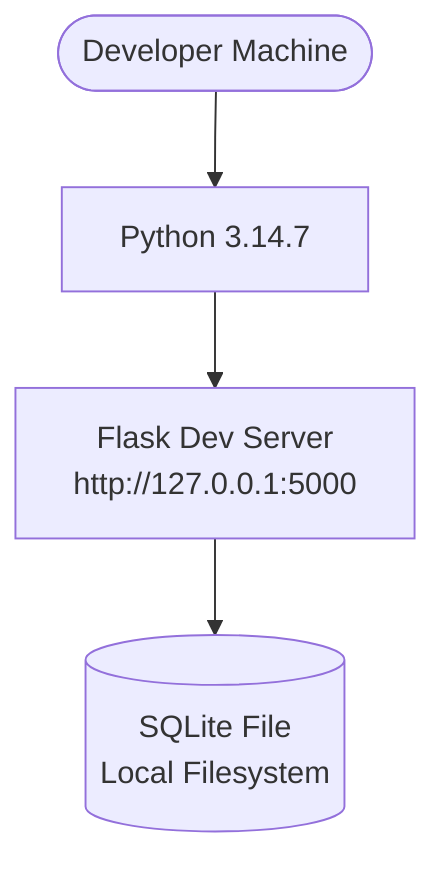
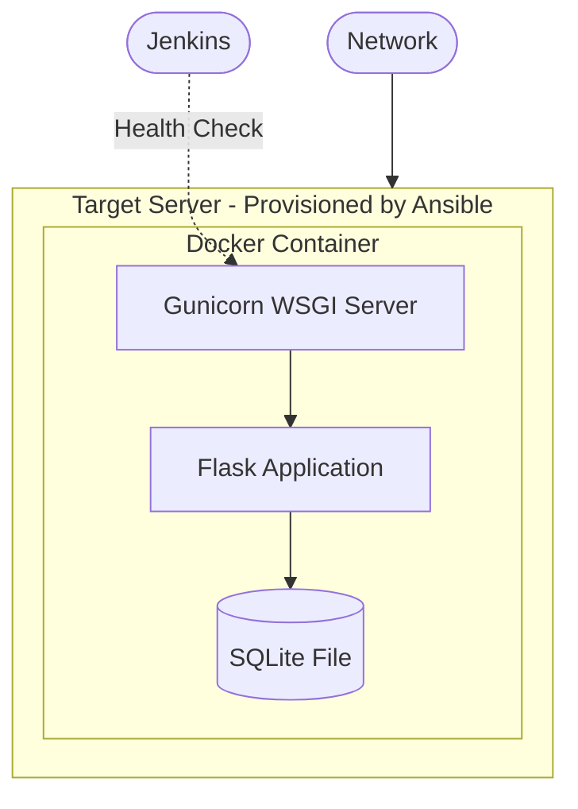

# Deployment Architecture

## Current Local Setup (Week 3)

The application currently runs only in a local development environment.

| Component | Status | Details |
|---|---|---|
| Flask Dev Server | Running locally | `python src/app.py` starts on port 5000 |
| SQLite Database | Not yet created | Will be created during Week 5-6 feature development |
| Health Endpoint | Verified | `/health` returns `{"status":"ok"}` |

## Future CI/CD Deployment (Planned for Weeks 11-14)

The planned target deployment architecture is shown below. **This is NOT yet implemented.**

| Component | Planned Tool | Implementation Week |
|---|---|---|
| Container Runtime | Docker | Week 11 |
| WSGI Server | Gunicorn | Week 11 |
| Server Provisioning | Ansible | Week 13-14 |
| CD Pipeline | Jenkins | Week 12 |
| Health Check | Jenkins | Week 14 |

**Important:** The deployment architecture is a plan. No Docker containers, Ansible playbooks, or Jenkins pipelines have been created yet.
