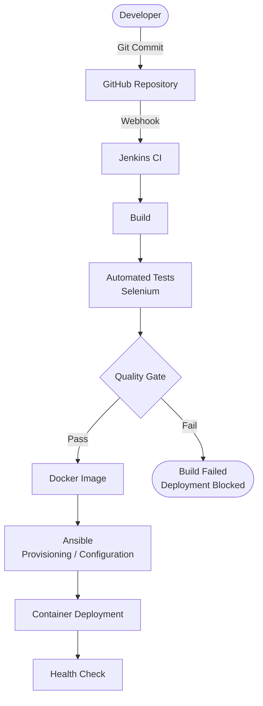

# DevOps Architecture

## CI/CD Pipeline Diagram

## Pipeline Stages

| Stage | Tool | Description | Implementation Week |
|---|---|---|---|
| **Code** | Git / GitHub | Version control, branching, pull requests. | Week 4 |
| **Build** | Jenkins, pip | Install dependencies and prepare the application. | Week 7-8 |
| **Test** | Selenium, pytest | Run automated UI and unit tests. | Week 9-10 |
| **Quality Gate** | Jenkins | If tests fail, pipeline halts and deployment is blocked. | Week 10 |
| **Package** | Docker | Build Docker image containing the Flask application. | Week 11 |
| **Provision** | Ansible | Configure the target server with Docker and dependencies. | Week 13-14 |
| **Deploy** | Jenkins + Docker | Deploy the container to the target environment. | Week 12 |
| **Health Check** | Jenkins | Verify the deployed application responds successfully. | Week 14 |

## Current Status (Week 3)
- **Implemented:** Local development environment only. Flask skeleton runs locally.
- **Planned:** All CI/CD pipeline stages above are planned for Weeks 4-14. None are configured yet.
