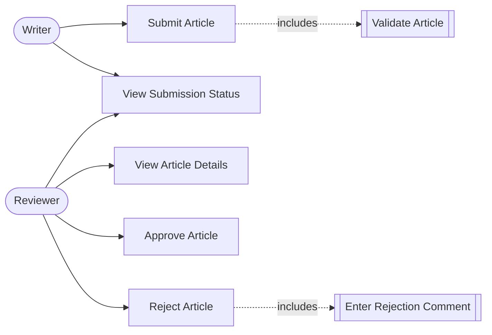

# Use-Case Diagram

## Diagram

## Actor Summary

| Actor | Use Cases |
|---|---|
| Writer | UC-01 Submit Article, UC-02 View Submission Status |
| Reviewer | UC-02 View Submission Status, UC-03 View Article Details, UC-04 Approve Article, UC-05 Reject Article |

## Included Behaviors

| Included Behavior | Triggered By | Description |
|---|---|---|
| Validate Article | UC-01 Submit Article | System checks that title, content, and author are not empty before saving. |
| Enter Rejection Comment | UC-05 Reject Article | System requires a mandatory comment before a rejection can be completed. |
